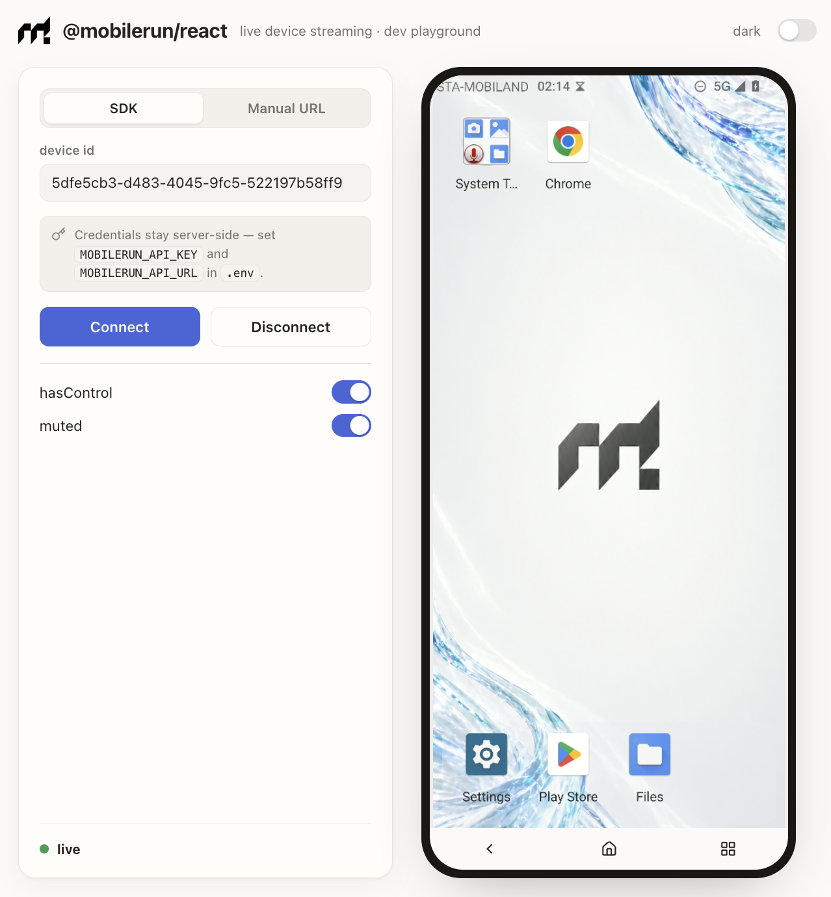

<p align="center">
  <picture>
    <source media="(prefers-color-scheme: dark)" srcset="assets/mobilerun-dark.png" />
    <source media="(prefers-color-scheme: light)" srcset="assets/mobilerun.png" />
    
  </picture>
</p>

<h1 align="center">@mobilerun/react</h1>

<p align="center">
  <strong>React components for embedding Mobilerun's native streaming.</strong><br />
  Live WebRTC video + full scrcpy remote control of a cloud device, in any React app.
</p>

<div align="center">

<a href="https://docs.mobilerun.ai">📕 Documentation</a>
·
<a href="https://cloud.mobilerun.ai">☁️ Mobilerun Cloud</a>

[](https://www.npmjs.com/package/@mobilerun/react)
[](./LICENSE)
[](https://mobilerun.ai)
[](https://react.dev)
[](https://discord.gg/ZZbKEZZkwK)

</div>

<p align="center">
  
</p>

## ✨ What you get

Drop a live, controllable cloud device (iOS/ Android) into any React app:

- 📺 **`<DeviceStream />`** — WebRTC video with touch, swipe and keyboard control, plus automatic reconnects with exponential backoff and a retry UI once attempts are exhausted.
- 🪝 **`useDeviceStream()`** — resolves a device's stream credentials from [`@mobilerun/sdk`](https://www.npmjs.com/package/@mobilerun/sdk), polling while it boots.
- 🧭 **`<NavigationBar />`**, **`<StreamStatusPill />`**, **`<RemoteControl />`** — the surrounding chrome and a lower-level escape hatch.
- 🎨 **Prebuilt stylesheet** — no Tailwind setup required, themeable via CSS variables.
- 📦 **Typed** — ships its own `.d.ts`; React and the SDK are peer dependencies.

## 📦 Install

```sh
npm install @mobilerun/react @mobilerun/sdk react react-dom
```

`react`, `react-dom` and `@mobilerun/sdk` are peer dependencies.

## 🚀 Quick start

The SDK's `Device` already carries everything the stream needs (`streamUrl` + `streamToken`). `useDeviceStream` fetches them and refreshes them when the stream reconnects:

> ⚠️ **`MOBILERUN_API_KEY` is a secret API key — never ship it to the browser.** It grants full account access, so the snippet below assumes a server-only context (RSC, route handler, SSR). In a client component, resolve `streamUrl` + `streamToken` on your backend instead and pass only those to `<DeviceStream />` — they're short-lived and scoped to a single device. See [Without the hook](#without-the-hook).

```tsx
import Mobilerun from '@mobilerun/sdk';
import { DeviceStream, useDeviceStream } from '@mobilerun/react';
import '@mobilerun/react/styles.css';

const client = new Mobilerun({ apiKey: process.env.MOBILERUN_API_KEY });

export function DevicePanel({ deviceId }: { deviceId: string }) {
  const { streamUrl, streamToken, state, refetch } = useDeviceStream({ client, deviceId });

  return (
    <div style={{ width: 360, height: 780 }}>
      <DeviceStream
        streamUrl={streamUrl}
        streamToken={streamToken}
        hasControl
        placeholderLabel={state}
        onStreamHealed={refetch}
      />
    </div>
  );
}
```

### Without the hook

Already have the device? Feed its fields straight in — no hook required:

```tsx
const device = await client.devices.retrieve(deviceId);

<DeviceStream streamUrl={device.streamUrl} streamToken={device.streamToken} hasControl />;
```

## 🧪 Try it locally

The repo ships the playground shown above — paste an API key + device id, or a raw `streamUrl` + `streamToken`, and stream a real device:

```sh
bun install
bun run example     # serves the playground at http://localhost:3000
```

In SDK mode the example server exposes one narrow helper endpoint backed by `@mobilerun/sdk` so the API key can stay server-side while retrieving `streamUrl` and `streamToken`. The stream WebSocket itself is opened directly by the browser against `streamUrl`; the component appends `streamToken` as `?token=`.

## 🎨 Styling & theming

Import the prebuilt stylesheet once, anywhere:

```ts
import '@mobilerun/react/styles.css';
```

It bundles the design tokens, only the Tailwind utilities the components use, the animations, and the structural CSS. It does **not** include Tailwind's preflight/reset, so it won't touch your base styles — and you don't need Tailwind installed.

Retheme by overriding the CSS variables on an ancestor (e.g. `--background`, `--card`, `--muted-foreground`, `--border`, `--primary`), or add a `.dark` ancestor for the bundled dark palette:

```css
:root {
  --primary: oklch(0.55 0.18 268);
  --background: oklch(0.985 0.004 85);
}
```

## 🛠 Building locally

```sh
bun install
bun run build       # tsup (JS + d.ts) + Tailwind (styles.css) → dist/
bun run typecheck
```

## 📄 License

[Apache-2.0](./LICENSE)
